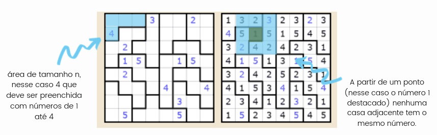

# Suguru Solver  </h1>
<h3 align="center">Código desenvolvido em Haskell para realizar a solução de tabuleiros do jogo Suguru.</h3>

  
  
  

##
O Suguru é um jogo de quebra-cabeça lógico cujo tabuleiro possui diversas áreas, de tamanhos diversos contendo posições adjacentes, o objetivo do jogo é, então, preencher cada uma dessas áreas com números de 1 até o tamanho da área. Para isso, existe uma regra: casas adjacentes tanto não podem conter o mesmo número.

  

##

Basicamente, para resolver esse puzzle, uma pessoa deveria:
* Buscar uma posição vazia;
* Olhar as posições adjacentes e escolher um número disponível para colocar na posição;
* Repetir até completar todos os quadrados em branco;
* Se não conseguir, apagar as respostas e tentar uma outra combinação possível.

##

No arquivo 'Main.hs' o usuário poderá informar alguns dados sobre o tabuleiro, como as áreas e os números presentes no ínicio do jogo.
<h5>Para realizar a entrada das áreas pré-definidas no tabuleiro, o úsuário realizará o input na matriz "ma".</h5>
<h5>Para os números presentes no tabuleiro utilizará a matriz "mp", com o número variando de 1 à n, sendo n o tamanho da área e 0 caso a posição não possuir um número.</h5>

#

  

